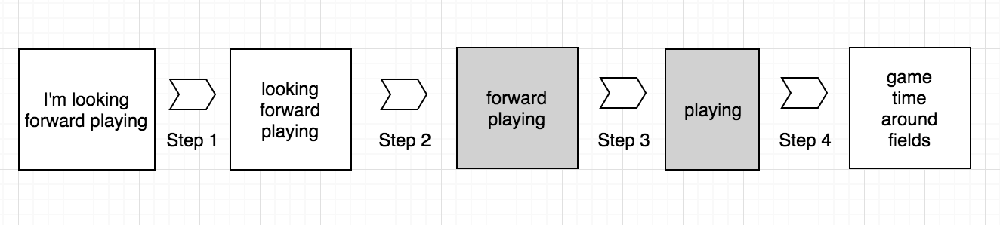

## Capstone Project: Algorithm to predict following text using the SwiftKey Dataset

This file describes the algorithm and all other necessary files to satisfy the shiny App requirement for the Final Data Science Capstone project.

### Instructions

The goal of this exercise is to create a product to highlight the prediction algorithm that you have built and to provide an interface that can be accessed by others. For this project you must submit:

1. Shiny app that takes as input a phrase (multiple words) in a text box input and outputs a prediction of the next word.
2. Slide deck consisting of no more than 5 slides created with R Studio Presenter pitching your algorithm and app as if you were presenting to your boss or an investor.
This repository contains all the files necessary to satisfy the shinyApps requirement

### Swiftkey Data

The data is from a corpus called HC Corpora. The files have been language filtered but may still contain some foreign text. In this capstone we will be applying data science in the area of natural language processing. The data used for this project can be accessed <a href="https://d396qusza40orc.cloudfront.net/dsscapstone/dataset/Coursera-SwiftKey.zip">here</a>. 

### Text Prediction Flow

In above flowchart you can see that the text prediction algorithm deployed as shiny apps. Specifically, at Step 2 in the flow chart, if a match is not found it will shorten the input in Step 3 and search again. For this implementation we add log(0.4) to the final probability.

* Step 1: Begin with user input and filter it to remove punctuation, contractions, numbers, common words, any extra white space etc.
    - If the user enters "I am looking forward playing " the algorithm will use "looking forward playing"
* Step 2: Search for a match, "looking forward playing _____"
    - If sufficient number of matches are found, then skip to Step 4
* Step 3: If more matches are needed we shorten user input and search again
    - "looking forward playing _____" >>> "forward playing _____"
* Step 4: Calculate probability scores for matches, add penalty if necessary
    - Log probability is employed to increase algorithm speed

### Calculating Probability Score

The formula below shows a conventional method used to calculate the probability. In our case the equation will be slightly different as we want to predict the next word.

**

*P(looking + forward + playing + game) = P(looking | \<start\>) \* P(forwarding | loooking) \*  P(playing | looking + forward) \* P(game | looking + forward + playing) *

**

To predict the next word begin with the left hand side of the equation below. The statement reads the probability of 'game' given 'looking forward playing'. Under Markov assumption we can reduce the computational complexity of this algorithm.

**

*P(game | looking + forward + playing) *  approximately equals to   *P(game | playing)*

**

The equation below shows that the model used to calculate the probability score for each predicted word. Multiplication is replaced with addition since we are using log probability. A penalty of log(0.4) is added to the probability score each time the sequence is shortened.

**

*P(game | looking + forward + playing) = log(P(looking + forward)/P(looking)) + 
    log(P(forward + playing) / P(forward)) + log(P(playing + game)/P(game)) *

**

If multiple matches are found for a sequence we rank them based on scores calculated from the above equation. If only one word is necessary to return we can use the equation below.

**

*max(P(game | looking + forward + playing), P(time | looking + forward + playing),
    P(fields | looking + forward + playing)) *

**

### Algorithm Rationale

Key considerations for algorithm design:

* The predictive model must be small enough to load into Shiny server. 

* When you type a phrase in the input box do you get a prediction of a single word after pressing submit and/or a suitable delay for the model to compute the answer?

Based on these requirements we chose a model based on existing NGrams. if given a long piece of text then we will shorten the user input to the last three words and use the 4-gram table. These tables (1,2,3,4 gram) are loaded from a .txt file prior to execution of the algorithm. The file ‘createFilteredTables.R’ shows how the raw data files are transformed into N-Gram tables.

It's possible that using machine learning method with an unseen sequence of text would cost extra memory and time. If the user provides random text to this algorithm we will return the most common unigrams. In this manner we avoid using extra memory while quickly returning a result.

### Repositories

* filteredTables.R: This file creates the file 'NGramSortedFinal.txt' using the raw data
    - This uses the files in the 'functions' folder
* profanity.RData: A list of words to remove
* NGramSortedFinal.txt: It contains four concatenated tables and the associated NGram counts
* divideNGram.RData: It contains positions used to divide the table from NGramSortedFinal.txt 
* NGramSortedFinal.txt and divideNGram.RData are used to load and divide the tables used for searching for a match.
* getPredWord.R: This is the main function called by server.R for the application interface
   - This file searches for matches based on the user input and calculates a penalty for the probability score
* global.R: It loads the lookup tables to search for matches, loads additional libraries and functions
* server.R: This has a code to access user input, calls functions necessary to predict the next word, and return results to the user interface
* ui.R: This has a code necessary for the application interface
    - Input: Text box that accepts a phrase, a drop down menu which sets the maximum number of words returned, and an "Predict" button which initiates the algorithm
    - Output: The original phrase, a filtered phrase that is provided to the algorithm, and a table that returns the predicted words

Shiny App

Click https://imshree.shinyapps.io/ShreeCapstone/ to view the working application.

